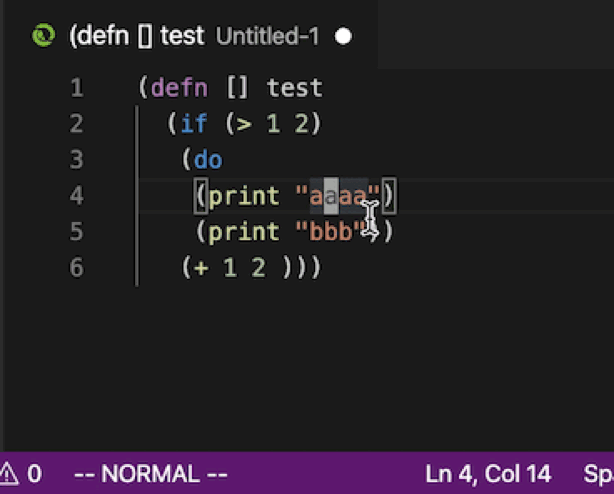

# Bracket Select
This is a simple plugin that support to quick select text between matched brackets.
This plugin supports `()`, `{}`, `[]`,`""`, `''`, and ``` `` ```, and can not be customized.  Unfortunally angle brackets `<>` are not supported due to RegEx being confused with math (`l < 1`).
Really hope this plugin can help you!


## Quick start
Just run command `BraSel:Select` or type `alt+a` to select text between brackets. If you wish to select more, just press it again.

If you slected more than you want, at anytime, just press `alt+z`(undo selection), you will bring the previous selections back.


  
If you wish to select text including the brackets, just run `BraSel:Select Include Brackets` or type `cmd+alt+a` on mac and `ctrl+alt+a` on windows.

This plugin is works for **multiple cursors**  now.


## Requirements
None

## Extension Settings

